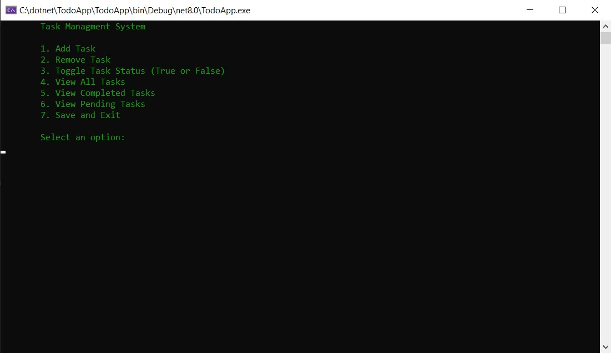
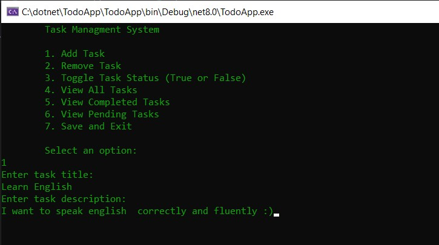
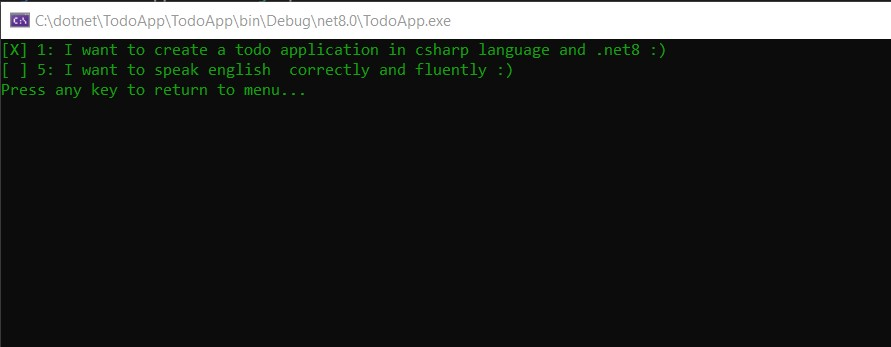

# Task managment system ( Todo App )

## Project overview
This console application was created using the C# programming language.
Using this system, you can easily create tasks, save them in a text file, display them, manage execution status, etc.

## Features
- Add task
- Remove task
- Toggle task status
- View all tasks
- View completed tasks
- View pending tasks
- Save to txt file
- Load tasks from a file when the application starts

## Screenshots
Menu:

Add task:  

View all tasks:
